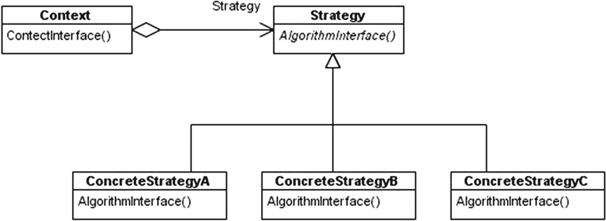

# strategy-pattern-example

Repositorio de aplicacion en NodeJS Javascript (ES6) utilizando Strategy Pattern

Definición:

Es un patron de comportamiento porque determina como se debe realizar el intercambio de mensajes entre diferentes objetos para resolver una tarea. El patron estrategia permite mantener un conjunto de algoritmos de entre los cuales el objeto cliente puede elegir aquel que le conviene e intercambiarlo dinámicamente según sus necesidades.

Diagrama UML:

Ejemplos:

1) Medios de pago de un seguro
2) Personajes de video juegos
3) Logger con estructura SF